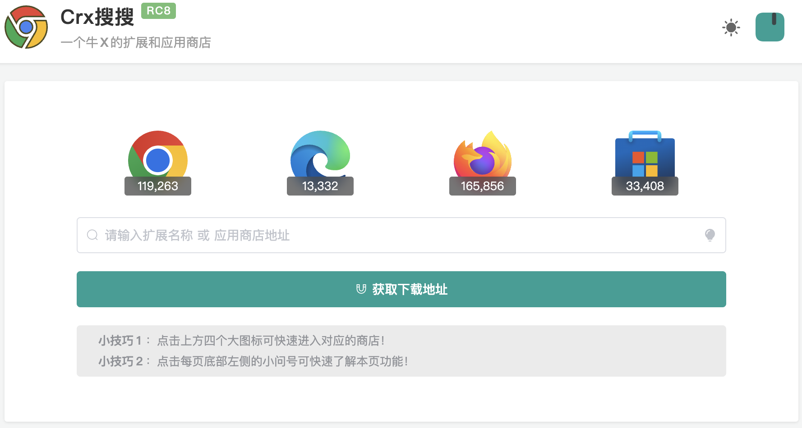

# ToolBox 工具库

## 1 Markdown

* [Markdown 在线编辑器](https://pandao.github.io/editor.md/)
* [作业部落 Markdown](https://www.zybuluo.com/mdeditor)
* [typora](https://typora.io/) 分享一个 Markdown 编辑器 typora，简洁高效，操作简单，界面美观，在书写文档的时候有全新的体验。
  进一步了解可参考这篇博客[初识 Typora](https://blog.csdn.net/mingzhuo_126/article/details/79941450)
* [myscript 网站可以手写公式，自动转为 LaTeX 语法](https://webdemo.myscript.com/)

## 2 图片处理

 ### 2.1 图床

* [sm.ms 免费图床](https://sm.ms/)     
  
  这个图床免费免注册，可以长期使用，很 nice
  
* [路过图床](https://imgchr.com/)

* [PicGo + Github 图床构建](https://blog.csdn.net/m0_64037602/article/details/130189259)

* [Typora+PicGo+Gitee 实现图片上传功能](https://juejin.cn/post/7018513691783987231)

 ### 2.2 图标下载

* [阿里矢量图标库 - 图标下载](https://www.iconfont.cn/)
  

* [icon8 图标](https://icons8.cn/)
  

* [视觉中国](https://www.vcg.com/)

### 2.3 Photoshop 在线精简版

* [Photoshop 在线精简版](https://www.uupoop.com/)

### 2.4 免费抠图工具

* [稿定设计](https://www.focodesign.com/create-design)
  

### 2.5 压缩图片

* [Picdiet](https://www.picdiet.com/zh-cn)
  

* [Squoosh](https://squoosh.app/)
  这是 Google 搞的一个免费开源在线压缩工具
  

* [docsmall](https://docsmall.com/image-compress)
  在线图片压缩,在线图片压缩软件,工具大全
  

* [TinyPNG](https://tinypng.com/)
  一个图片无损压缩网站
  

### 2.6 GIF 图处理

* [SOOGIF](https://www.soogif.com/)
  网站不仅提供了 gif 图像处理, 还提供了许多 gif 资源
  

### 2.7 图片放大

* [Waifu2x](http://waifu2x.udp.jp/)

### 2.8 图片处理

* [imagesTool](https://imagestool.com/zh_CN/index.html)
  无需上传文件也可在线处理图片的神器
  

## 3 文件格式转换

* [Office Converter](https://cn.office-converter.com/)
  支持视频、音频、图片、Office 文档等的文件转换工具
  

* [PickFrom](https://zh.pickfrom.net/)
  不仅仅可以转换文件，而且可以截图、下载视频呢
  

* [Smallpdf](https://smallpdf.com/)
  支持格式互转、压缩、合并、拆分 PDF
  

## 4 在线短信接收

* [在线短信接收](https://www.pdflibr.com/) 云短信
  

## 5 在线作图

* [在线作图ProcessOn](https://www.processon.com/)   支持流程图、思维导图、原型图、UML、网络拓扑图、组织结构图等
* [draw.io - 在线作图](https://app.diagrams.net/) 支持的类型比 Processon 更多，好看的既定样式也更多~

## 6 VPN分享

* [魔戒](https://mojie.in/#/dashboard)
* [Pigcha](https://github.com/pigpigchacha/PigchaVPN)

## 7 文件互传

* [轻松传](https://easychuan.cn/)
  轻松传输文件

* [奶牛快传](https://cowtransfer.com/)
  「奶⽜快传」是一款主打年轻客群的⼤⽂件传输服务，始终致⼒于提升⽤户体验及效率。

## 8 视频特效

* [视频特效 PhotoMosh ](https://photomosh.com/)
  提供抖音风格的特效，可以对图片、视频进行简单的处理
  

## 9 色彩搭配

* [https://flatuicolors.com/](https://flatuicolors.com/)

## 10 Jquery 特效插件

* [http://www.jq22.com/](http://www.jq22.com/)

## 11 CSS 特效

* [CodePen](https://codepen.io/)

## 12 获取图片

* [美桌壁纸网](http://www.win4000.com/)

## 13 PDF 获取

### 13.1 鸠摩搜索

* [https://www.jiumodiary.com/](https://www.jiumodiary.com/)

### 13.2 PDF 之家

* [http://pdfzj.cn/](http://pdfzj.cn/)

### 13.3 计算机书籍控

* [http://bestcbooks.com/](http://bestcbooks.com/)

### 13.4 淘链客

* [http://www.toplinks.cc/](http://www.toplinks.cc/)

### 13.5 Library Genesis

* [https://libgen.is/](https://libgen.is/)

### 13.6 Electronic library

* [https://b-ok.asia/](https://b-ok.asia/)

### 13.7 ITBook

* [https://itbook.download/](https://itbook.download/)

## 14 浏览器插件

* [CrxDL.COM](https://crxdl.com/)
下载Chrome扩展插件Crx离线安装包

* [Greasy Fork](https://greasyfork.org/zh-CN)
一个提供用户脚本的网站

* [极简插件](https://chrome.zzzmh.cn/#/index)
极简插件_Chrome扩展插件商店_优质crx应用下载

* [画夹插件网](https://huajiakeji.com/)
提供Chrome商店中优秀的Chrome插件推荐与下载服务

* [Crx搜搜](https://www.crxsoso.com/)
一个牛X的扩展和应用商店

* [油小猴](https://www.youxiaohou.com/zh-cn/mac.html)
一个汇聚了各种黑科技的小站

## 15 其他

* [万能兔工具网](https://www.wntool.com/)
* [工具网](https://www.tooleyes.com/)
* [Windows系统](https://msdn.itellyou.cn/)
* [MD5 解密](https://cmd5.la/)
* [SSL 漏洞在线检测工具](http://scan.ssleye.com/)

