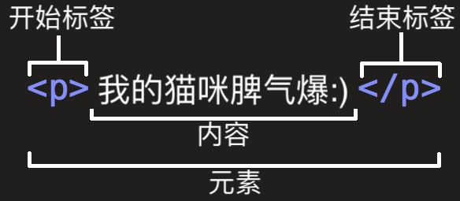
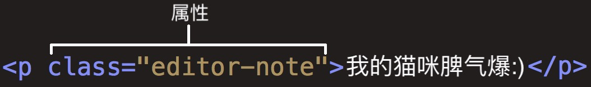
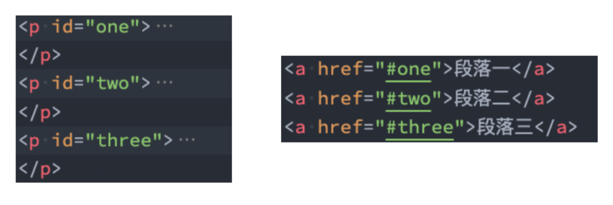

## 认识HTML

**超文本标记语言**（HyperText Markup Language，简称：HTML）是一种用于创建[网页](https://zh.wikipedia.org/wiki/%E7%BD%91%E9%A1%B5)的标准[标记语言](https://zh.wikipedia.org/wiki/%E6%A0%87%E8%AE%B0%E8%AF%AD%E8%A8%80)。

### 什么是标记语言

由无数个<font color=red size=5>标记（标签、tag）</font>组成。

- 是对**某些内容进行特殊的标记**，以供其他**解释器识别处理**
- 由**标签和内容**组成的称为**元素（element）**

### 什么是超文本（HyperText）

- 不仅仅可以插入**普通的文本（Text）**，还可以插入**图片、音频、视频**等内容

- 还可以表示**超链接（HyperLink）**，从一个网页跳转到另一个网页

### HTML文件的特点-扩展名

HTML文件的拓展名是`.htm/.html`

- win95/win98系统的文件拓展名不能超过3个字符，所以使用`.htm`
- 现在统一使用`.html`

## 认识元素

HTML本质上是由一系列的<font color=red size=5>元素（Element）</font>构成的。

### 什么是元素

元素是网页的一部分，一个元素可以**包含一个数据项，或是一块文本，或是一张照片，亦或是什么也不包含**。

### HTML元素有哪些元素

[HTML 元素参考 - HTML（超文本标记语言） | MDN](https://developer.mozilla.org/zh-CN/docs/Web/HTML/Element)

### 元素的组成



1. 开始标签
2. 结束标签
3. **内容**：元素的内容
4. **元素**：开始标签、结束标签与内容相结合，便是一个完整的元素

### 元素的属性



属性包含元素的额外信息，这些信息不会出现在实际的内容中。

**一个属性必须包含如下内容：** 

1. **一个空格**，在属性和元素名称之间
2. **属性名称**，后面跟着一个等于号
3. **一个属性值**，由一对引号<font color=red>""</font>引起来

## HTML结构分析

### 完整的HTML结构

一个完整的HTML结构包括：<font color=red size=4>文档声明</font>、<font color=red size=4>html元素</font>、<font color=red size=4>head元素</font>、<font color=red size=4>body元素</font>。

```html
<!DOCTYPE html>
<html>
  <head>
    <title>HTML文档结构</title>
  </head>
  <body>
    <h1>我是标题</h1>
  </body>
</html>
```

### 文档声明

HTML最上方的一段文本我们称之为**文档类型声明**，用于声明**文档类型**：`<!DOCTYPE html>`

- HTML文档声明，告诉浏览器当前页面是**HTML5页面**
- 让浏览器用**HTML5的标准去解析识别**内容
- 必须**放在HTML文档的最前面**，**不能省略**，省略了会出现兼容性问题

### html元素

**<html>**元素表示一个HTML文档的**根（顶级元素）**，所以被称为**根元素**，所有其他元素必须是**此元素的后代**。

W3C标准建议为html元素增加一个**lang属性**，作用是：

- 帮助语音合成工具确定要使用的发音
- 帮助翻译工具确定要使用的翻译规则
- `lang = "en"`表示HTML文档的语言是英文
- `lang = "zh-CN"`表示HTML文档的语言是中文

### head元素

**HTML head元素**规定文档相关的**配置信息（元数据）**，包括**文档的标题**，**引用的文档样式**和**脚本**等。

- 网页的标题：`title元素`
- 网页的编码：`meta元素`（一般使用`<meta charset="UTF-8">`），<font color=red>不设置或者设置错误会导致乱码</font>

### body元素

body元素里面的内容将是你**在浏览器窗口中看到的东西**，也就是**网页的具体内容和结构**。

## HTML元素

[HTML 元素参考 - HTML（超文本标记语言） | MDN](https://developer.mozilla.org/zh-CN/docs/Web/HTML/Element)

常见的元素：`p元素`、`h元素`、`img元素`、`a元素`、`iframe元素`、`div元素`、`span元素`

### img

`img`是一个<font color=red size=5>可替换元素</font>。

**可替换元素**（**replaced element**）的展现效果不是由 CSS 来控制的。这些元素是一种外部对象，它们外观的渲染，是独立于 CSS  的。

简单来说，可替换元素的内容不受当前文档的样式的影响。**CSS 可以影响可替换元素的位置，但不会影响到可替换元素自身的内容。**

CSS 能对可替换元素产生的唯一影响在于，部分属性支持控制元素内容在其框中的位置或定位方式。

- `src属性`：是**必须的**，包含了你想嵌入的图片的文件路径
- `alt属性`：不是强制性的
  - 作用一：当图片加载不成功（错误的地址或者图片资源不存在），那么会显示这段文本
  - 作用二：屏幕阅读器会将这些描述读给需要使用阅读器的使用者听，让他们知道图像的含义
- **网络图片**：一个 URL 地址
- **本地图片**
  - **绝对路径**：从根目录开始一直找到资源的路径（精确路径）
  - **相对路径**：相对于当前文件位置的一个路径

### a

<!-- tabs:start -->

#### **属性**
`target`：该属性指定在何处显示链接的资源

- `_self`：默认值，在当前窗口打开URL
- `_blank`：在一个新的窗口打开URL
- `_parent`：在父窗口中打开URL
- `_top`：在顶层窗口中打开URL

#### **锚点链接**
锚点链接可以实现<font color=red size=4>跳转到网页中的具体位置</font>

锚点链接有两个重要步骤：

- 在要跳到的元素上**定义一个id属性**
- 定义`a元素`，并且a元素的**href指向对应的id**



#### **图片链接**
- a元素中不存放文字，而是<font color=red>存放一个img元素</font>
- 也就是img元素是a元素的内容

#### **其他URL地址**
```html
<a href="https://github.com/coderwhy/HYMiniMall/archive/master.zip">HYMiniMall</a>
<a href="mailto:12345@qq.com">发送邮件</a>
```

<!-- tabs:end -->

### iframe

利用iframe元素可以实现：在一个HTML文档中嵌入其他HTML文档。

frameborder属性：**1**显示边框，**0**不显示边框。

### 不常用元素

- `strong元素`：内容加粗、强调
- `i元素`：内容倾斜
- `code元素`：用于显示代码
- `br元素`：换行元素
- [更多元素](https://developer.mozilla.org/zh-CN/docs/Web/HTML/Element)

## HTML全局属性

[全局属性](https://developer.mozilla.org/zh-CN/docs/Web/HTML/Global_attributes)

**常见的全局属性：**

`id`：定义唯一标识符

`class`：一个以空格分隔的元素的类名列表，它允许 CSS 和 Javascript 通过类选择器或者 DOM 方法来选择和访问特定的元素

`style`：给元素添加内联样式

`title`：包含表示与其所属元素相关信息的文本，这些信息通常可以作为提示呈现给用户，但不是必须的