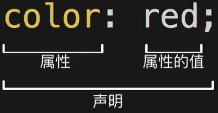
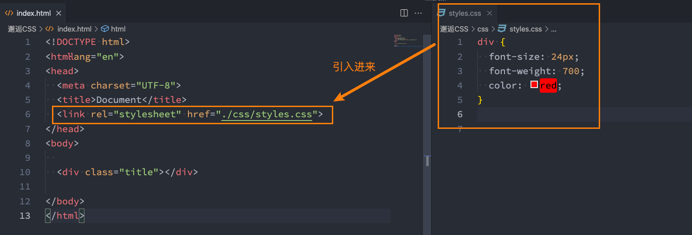
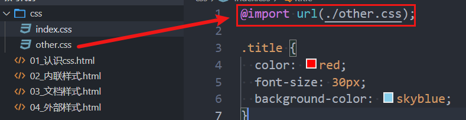

## 认识CSS

CSS表示层叠样式表（简称：CSS，又称为**串样式列表**、**级联样式表**、**串接样式表**、**阶层式样式表**）,是为网页添加<font color=red>样式的代码</font>。

CSS的出现是**为了美化HTML**的，并且让**结构（HTML）与样式（CSS）分离**。

MDN解释：CSS也不是真正的编程语言，甚至不是标记语言。它是一门样式表语言。

维基百科解释：是一种计算机语言，但是不算是一种编程语言。

## 编写CSS样式

<font size=3>语法规则</font>



<font color=red size=3>属性名</font>：要添加的CSS规则的名称;

<font color=red size=3>属性值</font>：要添加的CSS规则的值;

## CSS样式应用

CSS提供了3种方法，可以将CSS样式应用到元素上：<font color=red>内联</font>样式、<font color=red>内部</font>样式表、<font color=red>外部</font>样式表。

### 内联样式

内联样式表存在于<font color=red>HTML元素的style属性</font>之中。

CSS样式之间用分号<font color=red>;</font>隔开，建议每条CSS样式后面都加上分号<font color=red>;</font>

```html
<div style="color: red;font-size: 30px;">我是div元素</div>
<h1 style="font-size: 100px;">我是标题</h1>
```

### 内部样式表

将CSS放在HTML文件<font color=red>`<head>`元素里的`<style>`</font>元素之中。

```html
<head>
  <meta charset="UTF-8">
  <meta name="viewport" content="width=device-width, initial-scale=1.0">
  <title>Document</title>
  <style>
    .box {
      color: red;
      font-size: 16px;
    }
  </style>
</head>
```

### 外部样式表

**外部样式表**是将CSS编写在一个独立的文件中，并且<font color=red>通过<link>元素</font>引入进来。

<font color=red>第一步：</font>将css样式在一个独立的css文件中编写(后缀名为.css);

<font color=red>第二步：</font>通过`<link>`元素引入进来;



### @import

可以在style元素或者CSS文件中使用@import导入其他的CSS文件。



## CSS属性官方文档

[CSS官方文档地址](https://www.w3.org/TR/?tag=css)

[CSS推荐文档地址](https://developer.mozilla.org/zh-CN/docs/Web/CSS/Reference#%E5%85%B3%E9%94%AE%E5%AD%97%E7%B4%A2%E5%BC%95)

[查询CSS属性可用性](https://caniuse.com/)