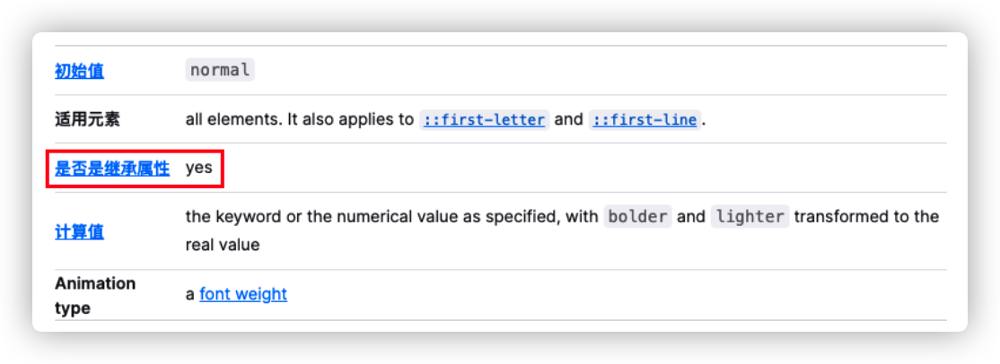

## 属性

### CSS 属性的继承

如果一个属性具备继承性，那么在该元素上设置后，它的后代元素都可以继承这个属性

如果后代元素自己有设置该属性，那么优先使用后代元素自己的属性（不管继承过来的属性权重多高）

> 常见的`font-size`、`font-family`、`font-weight`、`line-height`、`color`、`text-align`都具有继承性

### CSS 属性的层叠

对于一个元素来说，相同一个属性我们可以通过不同的选择器给它进行多次设置，那么属性会被一层层覆盖上去，最终只有一个会生效

选择器的权重，权重大的生效，权重相同时，后面设置的生效

| !important | 内联样式 | id 选择器 | 类选择器、属性选择器、伪类 | 元素选择器、伪元素 | 通配符 |
| :--------: | :------: | :-------: | :------------------------: | :----------------: | :----: |
|   10000    |   1000   |    100    |             10             |         1          |   0    |

### HTML 元素的类型

块级元素：独占父元素的一行

行内级元素：多个行内级元素可以在父元素的同一行中显示

### display 属性

| block                | inline                 | inline-block                         | none     |
| :------------------- | :--------------------- | :----------------------------------- | :------- |
| 让元素显示为块级元素 | 让元素显示为行内级元素 | 让元素同时具备行内级、块级元素的特征 | 隐藏元素 |

### display 值的特性（重要）

| block                                          | inline                   | inline-block             |
| ---------------------------------------------- | ------------------------ | ------------------------ |
| 独占父元素的一行                               | 和其他行内级元素在同一行 | 和其他行内级元素在同一行 |
| 可以设置宽度和高度，设置后依然独占父元素的一行 | 不可以设置宽高           | 可以设置宽高             |
| 高度默认由内容决定                             | 宽高都由内容决定         | 默认宽高由内容决定       |

### 元素隐藏的方法

1. `display`设置为`none`：元素不显示出来，并且也不占据位置，不占据任何空间（和不存在一样）
2. `visibility`设置为`hidden`：设置为`hidden`， 虽然元素不可见， 但是会占据元素应该占据的空间，默认为`visible`， 元素是可见的
3. `rgba`设置颜色， 将 a 的值设置为 0：`rgba`的 a 设置的是 alpha 值， 可以设置透明度， 不影响子元素
4. `opacity`设置透明度， 设置为 0：设置整个元素的透明度， 会影响所有的子元素

### overflow

> `overflow`用于控制内容溢出时的行为

- `visible`：溢出的内容照样可见
- `hidden`：溢出的内容直接裁剪
- `scroll`：溢出的内容被裁剪，但可以通过滚动机制查看，会一直显示滚动条区域，滚动条区域占用的空间属于`width`、`height`
- `auto`：自动根据内容是否溢出来决定是否提供滚动机制

### HTML 注意事项

#### 块级元素、inline-block 元素

一般情况下，可以包含其他任何元素（比如块级元素、行内级元素、inline-block 元素）

特殊情况下，p 元素不能包含其他块级元素

#### 行内级元素（比如 a、span、strong 等）

一般情况下，只能包含行内级元素

## 盒子模型

> [!warning|style:callout|label:注意]
> 对于行内级非替换元素来说， 设置宽高是无效的。

### 盒子模型

HTML 中每一个元素都**可以看做是一个盒子**，具备如下 4 个属性：

`padding`属性用于设置盒子的内边距， 通常用于设置边框和内容之间的间距。

`margin`属性用于设置盒子的外边距， 通常用于元素和元素之间的间距。

### margin 注意事项

> [!note|style:callout|label:建议]
>
> `margin`一般是用来设置兄弟元素之间的间距
>
> `padding`一般是用来设置父子元素之间的间距

#### 上下 margin 的传递

> margin-top 传递

如果块级元素的顶部线和父元素的顶部线重叠，那么这个块级元素的 margin-top 值会传递给父元素

> margin-bottom 传递

如果块级元素的底部线和父元素的底部线重叠，并且父元素的高度是 auto，那么这个块级元素的 margin-bottom 值会传递给父元素

> 如何防止出现传递问题？

- 给父元素设置`padding-top`、`padding-bottom`
- 给父元素设置`border`
- 触发 BFC: 设置 overflow 为 auto

#### 上下 margin 的折叠

- 垂直方向上相邻的 2 个`margin`（margin-top、margin-bottom）有可能会合并为 1 个 margin，这种现象叫做collapse（折叠）
- 水平方向上的`margin`（margin-left、margin-right）永远不会collapse

- 折叠后最终值由两个值进行比较，取较大的值
- 防止 margin collapse，只设置其中一个元素的 margin

### box-sizing

- `box-sizing`用来设置盒子模型中宽高的行为

- `content-box`：padding、border 都布置在 width、height 外边

- `border-box`：padding、border 都布置在 width、height 里边

### 外轮廓 - outline

> outline 表示元素的外轮廓

- 不占用空间
- 默认显示在 border 的外面

- 用来去除 a 元素、input 元素的 focus 轮廓效果

### 盒子阴影 - box-shadow

`box-shadow`可以设置一个或者多个阴影，每个阴影用<shadow>表示，多个阴影之间用逗号`,`隔开，从前到后叠加

- 第 1 个`<length>`：offset-x，水平方向的偏移，正数往右偏移
- 第 2 个`<length>`：offset-y，垂直方向的偏移，正数往下偏移
- 第 3 个`<length>`：blur-radius，模糊半径
- 第 4 个`<length>`：spread-radius，延伸半径
- `<color>`：阴影的颜色，如果没有设置，就跟随 color 属性的颜色
- inset：外框阴影变成内框阴影

[盒子阴影在线查看](https://html-css-js.com/css/generator/box-shadow/)

### 文字阴影 - text-shadow

`text-shadow`用法类似于`box-shadow`，用于给文字添加阴影效果

[文字阴影在线查看](https://html-css-js.com/css/generator/text-shadow/)

### 元素的水平居中方案

- 行内级元素（包括 inline-block 元素）：在父元素中设置`text-align: center`
- 块级元素：`margin: 0 auto`

## 注意事项

> 以下属性对行内级非替换元素不起作用

`width`、`height`、`margin-top`、`margin-bottom`

> 以下属性对行内级非替换元素的效果比较特殊

`padding-top`、`padding-bottom`、上下方向的`border`
