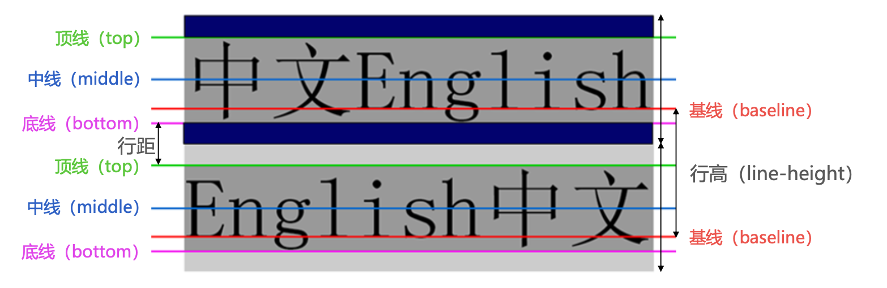
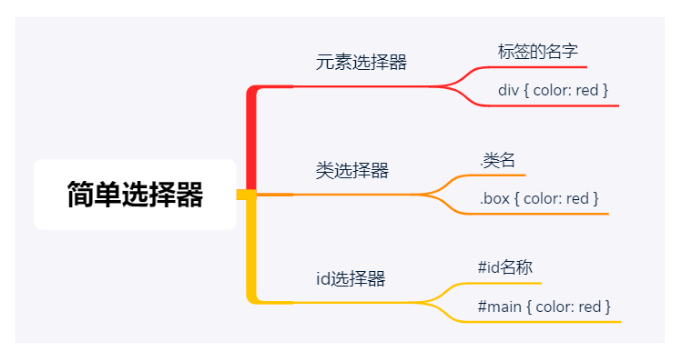
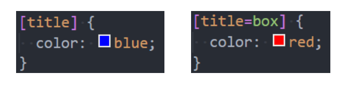
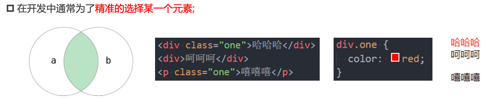
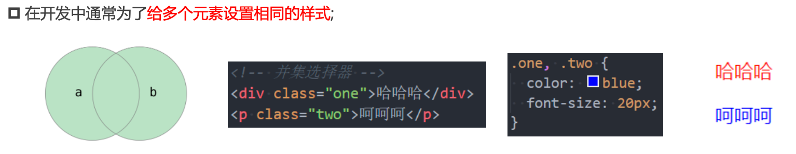
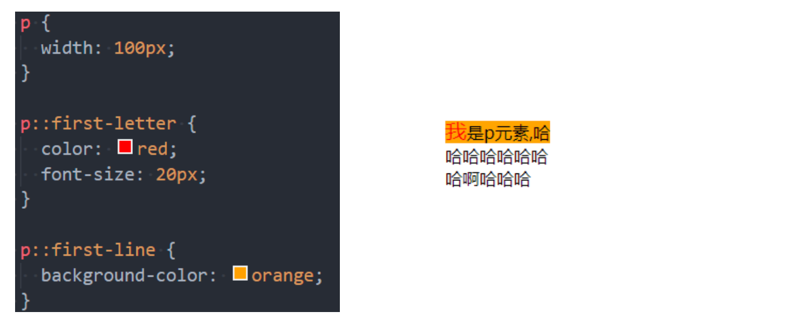
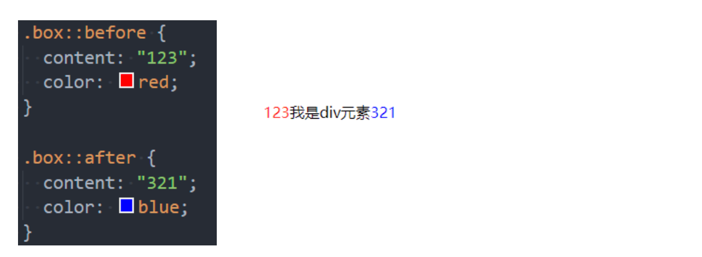

## 文本

### text-decoration（常用）

> 用于设置文字的装饰线

- <font color=red>none：</font>无任何装饰线（可以去除`a元素`默认的下划线）
- <font color=red>underline：</font>下划线
- <font color=red>overline：</font>上划线
- <font color=red>line-through：</font>中划线

### text-transform（一般）

> 用于设置文字的大小写转换

- <font color=red>capitalize：</font>将每个单词的首字符变为大写
- <font color=red>uppercase：</font>将每个单词的所有字符变为大写
- <font color=red>lowercase：</font>将每个单词的所有字符变为小写
- <font color=red>none：</font>没有任何影响

### text-indent（一般）

> 用于设置第一行内容的缩进

### text-align（重要）

> 用于设置文本的对齐方式

**MDN：定义行内内容（例如文字）如何相对它的块父元素对齐。**

- <font color=red>left：</font>左对齐
- <font color=red>right：</font>右对齐
- <font color=red>center：</font>居中对齐
- <font color=red>justify：</font>两端对齐

### letter-spacing、word-spacing（一般）

> letter-spacing、word-spacing分别用于设置字母、单词之间的间距

## 字体

### font-size（重要）

> 用于设置文字的大小

- <font color=red>具体数值+单位：</font>100px
- <font color=red>百分比：</font>基于父元素的font-size计算，比如50%表示等于父元素font-size的一半

### font-weight（重要）

> 用于设置文字的粗细

- 100 | 200 | 300 | 400 | 500 | 600 | 700 | 800 | 900：每一个数字表示一个重量
- <font color=red>normal：</font>等于400
- <font color=red>bold：</font>等于700

### line-height（常用）

> 用于设置文本的行高

行高可以先简单<font color=red>理解为一行文字所占据的高度</font>

<font color=red>line-height</font> - 文本的高度 = 行距

<br/>

行高的严格定义是：**两行文字基线之间的间距**

基线：**与小写字母x最底部对齐的线**



假设div中只有一行文字，如何让这行文字<font color=red>在div内部垂直居中：</font>让line-height等同于height

### font

> font是一个缩写属性

font 属性可以用来作为 font-style, font-variant, font-weight, font-size, line-height 和 font-family 属性的简写;

- font-style、font-variant、font-weight可以随意调换顺序，也可以省略
- /line-height可以省略，如果不省略，必须跟在font-size后面
- font-size、font-family不可以调换顺序，不可以省略

## CSS常见选择器

### 通用选择器

> 所有的元素都会被选中，一般用来给所有元素做一些通用性的设置

- 比如内边距、外边距
- 比如重置一些内容
- <font color=red>效率比较低，尽量不要使用</font>

### 简单选择器

- 元素选择器，使用<font color=red>元素的名称</font>
- 类选择器，使用<font color=red>.类名</font>
- id选择器，使用<font color=red>#id</font>



### 属性选择器

拥有某一个属性 <font color=red>[att]</font>

属性等于某个值 <font color=red>[att=val]</font>



- <font color=red>[attr*=val]：</font>属性值包含某一个值val
- <font color=red>[attr^=val]：</font>属性值以val开头
- <font color=red>[attr$=val]：</font>属性值以val结尾
- <font color=red>[attr|=val]：</font>属性值等于val或者以val开头后面紧跟连接符
- <font color=red>[attr~=val]：</font>属性值包含val，如果有其他值必须以空格和val分割

### 后代选择器

- 所有的后代（直接/间接的后代）:选择器之间以<font color=red>空格</font>分隔

- 直接子代选择器（必须是直接子代）:选择器之间以 <font color=red>></font> 分隔

```html
<div class="box">
  <div>
    <span>哈哈哈</span>
  </div>
</div>

<div class="box">
  <span>呵呵呵</span>
</div>
```

```css
# 所有的后代
.box span {
  color: red;
}

# 直接子代
.box > span {
  color: red;
}
```

### 兄弟选择器

- 相邻兄弟选择器：选择器之间使用符号 <font color=red>+</font> 连接
- 普遍兄弟选择器：选择器之间使用符号 <font color=red>~</font> 连接

```html
<div class="one">哈哈哈</div>
<div>呵呵呵</div>
<div>嘿嘿嘿</div>
<div>嘻嘻嘻</div>
```

```css
# 相邻兄弟选择
.one + div {
  color: red;
}

# 普遍兄弟选择
.one ~ div {
  color: red;
}
```

### 选择器组 - 交集选择器

**交集选择器：需要同时符合两个选择器条件（两个选择器紧密连接）**



**并集选择器：符合一个选择器条件即可（两个选择器以,号分割）**



## 伪类

[所有的伪类](https://developer.mozilla.org/zh-CN/docs/Web/CSS/Pseudo-classes)

动态伪类编写顺序建议为：`:link`、`:visited`、`:focus`、`:hover`、`:active`

### 伪元素

> 为了区分伪元素和伪类，建议伪元素使用2个冒号，比如::first-line

::first-line可以针对<font color=red>首行文本设置属性</font>

::first-letter可以针对<font color=red>首字母设置属性</font>



**::before**和 **::after**用来在一个元素的<font color=red>内容之前或之后插入其他内容</font>（可以是文字、图片）

常通过<font color=red>content属性</font>来为一个元素添加修饰性的内容

