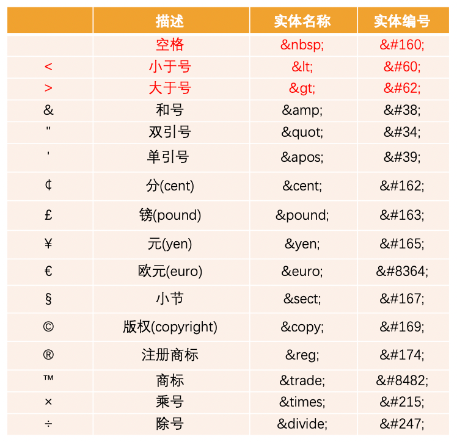
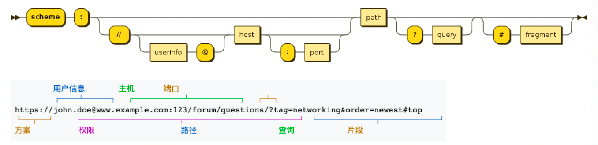
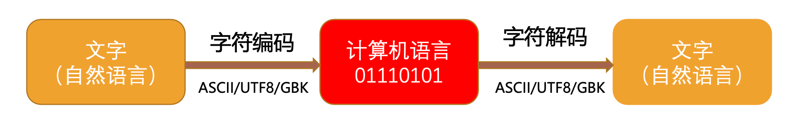

## 字符实体

HTML实体是一段**以连字号（&）开头**、**以分号（;）结尾的文本**：实体常常用于显示**保留字符**和**不可见的字符**(如“不换行空格”)。

## 认识URL

**URL代表着是统一资源定位符**，通俗点说：URL无非就是一个给定的独特资源在Web上的地址。

- 理论上，每个有效的URL都指向一个唯一的资源
- 这个资源可以是一个HTML页面，一个CSS文档，一副图像，等等

### URL的格式

URL的标准格式：

[协议类型]://[服务器地址]:[端口号]/[文件路径][文件名]?[查询]#[片段ID]

### URL和URI的区别

- URI = Uniform Resource Identifier 统一资源**标志符**，用于标识**Web技术使用的逻辑或物理资源**
- URL = Uniform Resource Locator 统一资源**定位符**，俗称**网络地址**，相当于**网络中的门牌号**
- URI在某一个规则下能把一个资源独一无二的识别出来
- URL作为一个网络Web资源的地址，可以唯一将一个资源识别出来，所以URL是一个URI
- URL是URI的一个子集
- URI并不一定是URL

## 元素语义化

元素语义化就是用正确的元素做正确的事情。虽然在理论上，所有的html元素都可以通过css样式实现相同的事情，但是这么做会使事情复杂化，所以需要元素语义化来降低复杂度。

**元素语义化的好处**：

- 提高代码的阅读性和可维护性
- 减少开发者之间的沟通成本
- 能让语音合成工具正确识别网页元素的用途，以便作出正确的反应
- 有利于SEO（Search Engine Optimization）

## SEO

SEO就是搜索引擎优化(Search Engine Optimization)，SEO通过了解搜索引擎的运行规则来调整网站，以提高网站的曝光度,以及网站的排名。

Google搜索引擎的工作流程主要分为三个阶段：

**抓取**：Google使用名为“抓取工具”的自动程序搜索网络，以查找新网页或更新后的网页。Google 会将这些网页的地址（即网址）存储在一个大型列表中，以便日后查看。我们会通过许多不同的方法查找网页，但主要方法是跟踪我们已知的网页中的链接。

**编入索引**：Google 会访问它通过抓取得知的网页，并会尝试分析每个网页的主题。Google 会分析网页中的内容、图片和视频文件，尝试了解网页的主题。这些信息存储在 Google 索引中，而 Google 索引是一个存储在海量计算机中的巨大数据库。

**呈现搜索结果**：当用户在 Google 上进行搜索时，Google 会尝试确定最优质的搜索结果。“最佳”结果取决于许多因素，包括用户的位置、语言、设备（桌面设备或手机）以及先前用过的搜索查询。例如，在用户搜索“自行车维修店”后，Google 向巴黎用户显示的答案与向香港用户显示的答案有所不同。支付费用不能提高网页在 Google 搜索结果中的排名，网页排名是完全依靠算法完成的。

## 认识字符编码

计算机只认识0和1，但我们各个国家的人都需要在计算机上使用各自的文字，为了在计算机上也能表示、存储和处理像文字、符号等等之类的字符，就必须将这些字符转换成二进制。

当然，肯定不是想怎么转换就怎么转换，否则就会造成同一段二进制数字在不同计算机上显示出来的字符不一样的情况，因此必须得定一个统一的、标准的转换规则。

[字符编码发展历史](https://www.jianshu.com/p/899e749be47c)

## 补充

1、软件和应用程序的区别：

- 软件包括操作系统及虚拟机、编程（语言）、算法、应用程序等，软件是应用程序的超集

- 应用程序是一种直接面向用户的软件

2、网页从编写到浏览器显示的整个过程：

- 编写HTML、CSS、JS代码

- 打包发布到服务器作为静态资源

- 用户在浏览器输入域名

- 浏览器发出静态资源请求

- DNS将域名转换成IP地址

- 浏览器找到服务器的IP地址，服务器返回静态资源给浏览器

- 浏览器解析和渲染静态资源，显示网页

3、浏览器内核是什么，有哪些常见的浏览器内核：

- 浏览器内核又称浏览器渲染引擎，是浏览器最核心部分，负责解析网页语法并渲染网页

- `Trident（三叉戟）`：IE浏览器、360安全浏览器、UC浏览器、搜狗高速浏览器、百度浏览器

- `Gecko（壁虎）`：Mozilla、Firefox

- `Presto -> Blink` ：Opera

- `Webkit` ：Safari、360极速浏览器、搜狗高速浏览器、移动端浏览器

- `Webkit -> Blink` ：Chrome、Edge

4、div元素和span元素的作用和区别：

- div元素跟span元素都是纯粹的容器，也可以称作**盒子**，都是用来包裹内容的

- div元素包裹的内容会显示在不同的行，可以把网页分成多个独立的部分，一般作为其他的元素的父容器

- span元素包裹的内容会显示在同一行，默认情况下是跟普通的文本没有区别，可以用来凸显一些关键字